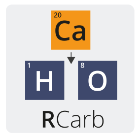

<!-- README.md was auto-generated by README.Rmd. Please DO NOT edit by hand!-->


```{r, echo = FALSE}
knitr::opts_chunk$set(
  collapse = TRUE,
  comment = "#>",
  fig.path = "man/figures/README-"
)
library(RCarb)
```


# RCarb 

The **R** package 'RCarb' provides a collection of various R functions to model dose rates
in carbonate-rich samples. The package is a translation of the 'MATLAB' program *Carb* by Roger P. Nathan.

[](https://CRAN.R-project.org/package=RCarb)
[](https://www.r-pkg.org/pkg/RCarb)
[](https://travis-ci.org/R-Lum/RCarb)
[](https://ci.appveyor.com/project/RLumSK/rcarb)
[](https://codecov.io/gh/R-Lum/RCarb)


## Installation of the developer version

To install the latest development builds of 'RCarb' directly from GitHub, run

```r
if(!require("devtools"))
  install.packages("devtools")
devtools::install_github("R-Lum/RCarb@master")
```

To install a developer build other than 'master', replace the term 'master' in the codeline by the name
of the wanted developer build (not available yet). 

Please further note that this version is a development version and may change day by day. 
For stable branches please visit the package on [CRAN](https://CRAN.R-project.org/package=RCarb).

## License

This program is free software: you can redistribute it and/or modify it under the terms of the 
GNU General Public License as published by the Free Software Foundation, either version 3 of the License, or any later version.

This program is distributed in the hope that it will be useful, but WITHOUT ANY WARRANTY; without even the implied warranty of MERCHANTABILITY or FITNESS FOR A PARTICULAR PURPOSE. See the [GNU General Public License](https://github.com/R-Lum/RCarb/blob/master/LICENSE) for more details.

## Related projects 

* [Luminescence](https://github.com/R-Lum/Luminescence)
* [RLumModel](https://github.com/R-Lum/RLumModel)
* [RLumShiny](https://github.com/R-Lum/RLumShiny)

## References

Nathan, R.P., Mauz, B., 2008. On the dose-rate estimate of carbonate-rich sediments for trapped charge dating. Radiation Measurements 43, 14–25. doi: [10.1016/j.radmeas.2007.12.012](https://dx.doi.org/10.1016/j.radmeas.2007.12.012)

Mauz, B., Hoffmann, D., 2014. What to do when carbonate replaced water: Carb, the model for estimating the dose rate of carbonate-rich samples. 
Ancient TL 32, 24–32. http://ancienttl.org/ATL_32-2_2014/ATL_32-2_Mauz_p24-32.pdf

**Further reading**

Nathan, R.P., 2010. Numerical modelling of environmental dose rate and its application to trapped-charge dating.
DPhil thesis, St Hugh’s College, Oxford. https://ora.ox.ac.uk/objects/ora:6421

## <span class="glyphicon glyphicon-euro"></span> Funding

Between 2018-2019, the work of Sebastian Kreutzer as maintainer of the package was supported
by LabEx LaScArBxSK (ANR - n. ANR-10-LABX-52).
