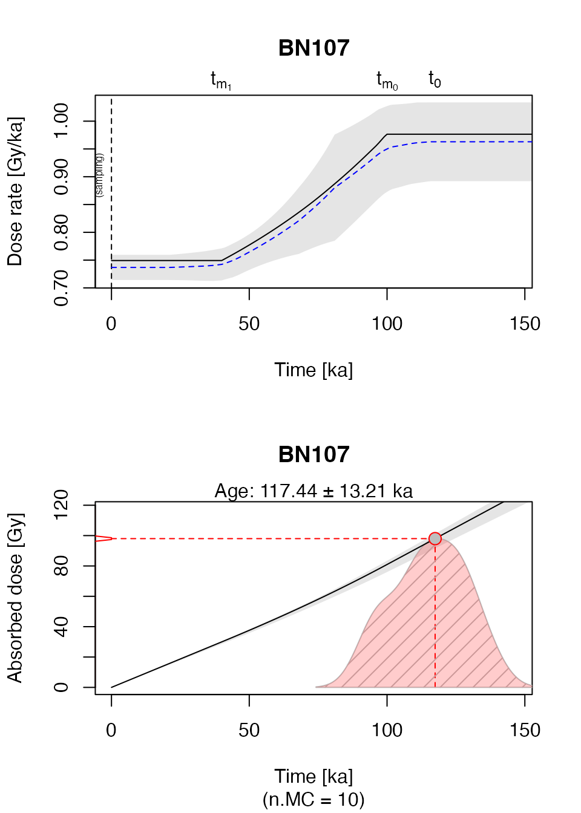
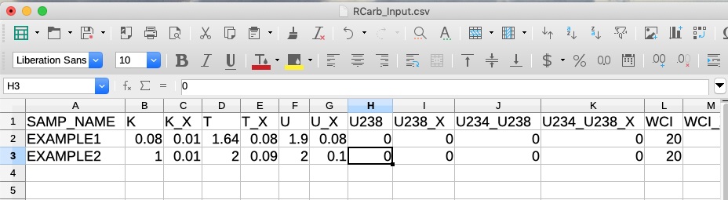

# Get started with RCarb

¹LIAG Institute for Applied Geophysics, Hannover, Germany\
²Institute of Geography, Heidelberg University, Heidelberg, Germany\
³Department of Geography and Geology, University of Salzburg, Salzburg
(Austria)”


## Scope

Getting started with a new **R** package can be a very tedious business
(if not to say annoying). This document was written with the intention
to make your first steps as painless as possible.

## Quick start with the example dataset

If you have no idea what a function does and how it works, it is always
a good idea to have a closer look into the example sections of the
package functions. The package `'RCarb'` has one central function named
[`model_DoseRate()`](https://r-lum.github.io/RCarb/reference/model_DoseRate.md).
The example given in the example section in the manual will be used in
the following to illustrate the central package functionality in three
steps.

### Load ‘RCarb’

``` r

library(RCarb)
```

### Load example data

``` r

##load example data
data("Example_Data", envir = environment())
```

To get a first impression on how the example dataset looks like, you
call the function [`head()`](https://rdrr.io/r/utils/head.html) to print
the first five rows of a `data.frame` on the terminal.

``` r

head(Example_Data)
```

    ##   SAMP_NAME     K   K_X    T  T_X    U  U_X U238 U238_X U234_U238 U234_U238_X
    ## 1     BN107 0.080 0.010 1.64 0.08 1.90 0.08    0      0         0           0
    ## 2     BN102 0.170 0.009 2.59 0.03 3.02 0.07    0      0         0           0
    ## 3     BN106 0.560 0.030 1.80 0.11 0.83 0.03    0      0         0           0
    ## 4      LV61 0.131 0.005 0.85 0.03 0.86 0.11    0      0         0           0
    ## 5      LV99 0.047 0.003 0.59 0.03 1.94 0.11    0      0         0           0
    ## 6      D101 0.105 0.004 0.65 0.02 1.25 0.08    0      0         0           0
    ##   WCI WCI_X WCF WCF_X CC CC_X DIAM DIAM_X COSMIC COSMIC_X INTERNAL INTERNAL_X
    ## 1  20     7   7     7 62    1  180     10  0.180   0.0100        0          0
    ## 2  20    10  10    10 68    1  180     22  0.180   0.0100        0          0
    ## 3  20     6   6     6 49    1  145     15  0.180   0.0100        0          0
    ## 4  12     5   2     2 17    1  210     30  0.069   0.0035        0          0
    ## 5   8     3   5     5 61    3  210     30  0.182   0.0090        0          0
    ## 6   8     3   2     2 59    2  210     20  0.180   0.0100        0          0
    ##   ONSET ONSET_X FINISH FINISH_X  DE DE_X
    ## 1   100      10     40       10  98    9
    ## 2   100      10     40       10 130   10
    ## 3   100      10     40       10 120   10
    ## 4   120      10     40       10  52    5
    ## 5    60      10     40       10  50    4
    ## 6   180      10    130       10  81    5

Unfortunately, the naming of the table columns is not straightforward to
understand. The good news is that each column carries additional
information that can be seen in the **R** terminal by typing, e.g., for
the column ‘K’ (which is the 2nd column):

``` r

attributes(Example_Data$K)
```

    ## $UNIT
    ## [1] "%"
    ## 
    ## $DESCRIPTION
    ## [1] "K concentration"

It reveals that the numbers in the column correspond to the potassium
concentration and are given in ‘%’. Similar all other columns can be
inspected.

And here the full overview

| COLUM       | UNIT      | DESCRIPTION                               |
|:------------|:----------|:------------------------------------------|
| SAMP_NAME   | NA        | Sample name, unique identifier            |
| K           | %         | K concentration                           |
| K_X         | %         | K concentration standard error            |
| T           | ppm       | Th concentration                          |
| T_X         | ppm       | Th concentration standard error           |
| U           | ppm       | U concentration                           |
| U_X         | ppm       | U concentration standard error            |
| U238        | ppm       | U-238 concentration                       |
| U238_X      | ppm       | U-238 concentration standard error        |
| U234_U238   | NA        | U-234/U-238 activity ratio                |
| U234_U238_X | NA        | U-234/U-238 activity ratio standard error |
| WCI         | % dry wt. | Initial water content                     |
| WCI_X       | % dry wt. | Initial water content standard error      |
| WCF         | % dry wt. | Final water content                       |
| WCF_X       | % dry wt. | Final water content standard error        |
| CC          | % dry wt. | Carbonate content                         |
| CC_X        | % dry wt. | Carbonate content standard error          |
| DIAM        | m x 10^-6 | Grain diameter                            |
| DIAM_X      | m x 10^-6 | Grain diameter standard error             |
| COSMIC      | Gy/ka     | Cosmic dose rate                          |
| COSMIC_X    | Gy/ka     | Cosmic dose rate standard error           |
| INTERNAL    | Gy/ka     | Internal dose rate                        |
| INTERNAL_X  | Gy/ka     | Internal dose standard error              |
| ONSET       | ka        | Carbonate onset                           |
| ONSET_X     | ka        | Carbonate onset standard error            |
| FINISH      | ka        | Carbonate completion                      |
| FINISH_X    | ka        | Carbonate completion standard error       |
| DE          | Gy        | Equivalent dose                           |
| DE_X        | Gy        | Equivalent dose standard error            |

### Run dose rate modelling

Now we want to start the modelling using the data given for the first
sample only.

``` r

##extract only the first row 
data <- Example_Data[1,]

##run model 
results <- model_DoseRate(
  data = data,
  DR_conv_factors = "Carb2007",
  n.MC = 10, 
  txtProgressBar = FALSE)
```

    ## 
    ## [model_DoseRate()]
    ## 
    ##  Sample ID:       BN107 
    ##  Equivalent dose:     98  ±  9 Gy
    ##  Diameter:        180 µm 
    ##  MC runs error estim.:    10  
    ##  ------------------------------------------------ 
    ##  Age (conv.):         133.451  ±  16.27  ka
    ##  Age (new):       117.443  ±  13.21  ka
    ## 
    ##  Dose rate (conv.):   0.734  ±  0.029  Gy/ka
    ##  Dose rate (onset):   0.963  ±  0.071  Gy/ka
    ##  Dose rate (final):   0.737  ±  0.023  Gy/ka
    ##  ------------------------------------------------



The function returns a terminal output along with two plots, which are
mostly similar to the original graphical output provided by the ‘MATLAB’
program ‘Carb’.

In the example above the function
[`model_DoseRate()`](https://r-lum.github.io/RCarb/reference/model_DoseRate.md)
was called with three additional arguments,
`DR_conv_factors = "Carb2007"`, `n.MC = 10`, `txtProgressBar = FALSE`.
The first argument selects the dose rate conversion factors used by
‘RCarb’. The second argument limits the number of Monte Carlo runs for
the error estimation to 10 and the second argument prevents the plotting
of the progress bar, indicating the progression of the calculation. Both
arguments were solely set to reduce calculation time and output in this
vignette.

Obviously, you do not want to run each row in the input table separately
to model all dose rates, so to run all the modelling for all samples in
the example dataset you can call the model without subsetting the
dataset first. **Be careful, the calculation may take some time**.

``` r

results <- model_DoseRate(
  data = Example_Data)
```

*A note on the used dose rate conversion factors: For historical reasons
‘Carb’ has its own set of dose rate conversion factors, which differ
slightly from values in the literature (e.g., Adamiec & Atiken, 1998)
and are used in `'RCarb'` as default values. However, with
`'RCarb' >= 0.1.3` you can select other dose rate conversion factors.
Please type
[`?RCarb::Reference_Data`](https://r-lum.github.io/RCarb/reference/Reference_Data.md)
in your **R** terminal for further details.*

## Using your own dataset

Running only the example dataset is somewhat dissatisfactory, and the
usual case will be that you provide your own dataset as input. While you
can enter all data directly using R, the package offers another way,
using external spreadsheet software such as ‘Libre Office’ (or, of
course, MS Excel). The procedure is sketched in the following.

### Create template table

The function
[`write_InputTemplate()`](https://r-lum.github.io/RCarb/reference/write_InputTemplate.md)
was written to create a template table (a CSV-file) that can be
subsequently opened and filled. Using the function ensures that your
input data have the correct structure, e.g., the correct number for
columns and column names. The argument `nrows` in the functions enables
you to generated as many rows you will need as input for your samples.

``` r

write_InputTemplate(file = "files/RCarb_Input.csv")
```

The path given with the argument `file` can be modified as needed.

### Enter own data & back import into R

Own data are added using an external spreadsheet program and then save
again as CSV-file.



For re-importing, the data standard R functionality can be used.

``` r

data <- read.csv(file = "files/RCarb_Input.csv")
```

### Model the dose rate

The final modelling does not differ from the call already show above
(here without a plot output):

``` r

##run model 
results <- model_DoseRate(
  data = data,
  n.MC = 10, 
  txtProgressBar = FALSE, 
  plot = FALSE)
```

    ## 
    ## [model_DoseRate()]
    ## 
    ##  Sample ID:       EXAMPLE 
    ##  Equivalent dose:     98  ±  9 Gy
    ##  Diameter:        180 µm 
    ##  MC runs error estim.:    10  
    ##  ------------------------------------------------ 
    ##  Age (conv.):         133.451  ±  12.659  ka
    ##  Age (new):       117.443  ±  8.743  ka
    ## 
    ##  Dose rate (conv.):   0.734  ±  0.04  Gy/ka
    ##  Dose rate (onset):   0.993  ±  0.086  Gy/ka
    ##  Dose rate (final):   0.732  ±  0.031  Gy/ka
    ##  ------------------------------------------------

## I don’t like R

Well, then you are wrong here. However, if you are just tired of using
the **R** terminal and you want to have a graphical user interface to
interact with ‘RCarb’? Surprise: We also spent countless hours to
develop a shiny application called ‘RCarb app’, and we ship it as part
of the **R** package
[‘RLumShiny’](https://CRAN.R-project.org/package=RLumShiny).

### References

Adamiec, G., Aitken, M.J., 1998. Dose-rate conversion factors: update.
Ancient TL 16, 37–50.
[10.26034/la.atl.1998.292](https://doi.org/10.26034/la.atl.1998.292)
