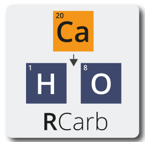

# Package index

## All functions

- [`Example_Data`](https://r-lum.github.io/RCarb/reference/Example_Data.md)
  : Example data

- [`RCarb-package`](https://r-lum.github.io/RCarb/reference/RCarb-package.md)
  [`RCarb`](https://r-lum.github.io/RCarb/reference/RCarb-package.md) :

  RCarb - Dose Rate Modelling of Carbonate-Rich Samples
  \

- [`Reference_Data`](https://r-lum.github.io/RCarb/reference/Reference_Data.md)
  : Reference data

- [`model_DoseRate()`](https://r-lum.github.io/RCarb/reference/model_DoseRate.md)
  : Model dose rate evolution in carbonate-rich samples

- [`write_InputTemplate()`](https://r-lum.github.io/RCarb/reference/write_InputTemplate.md)
  : Write table input template
